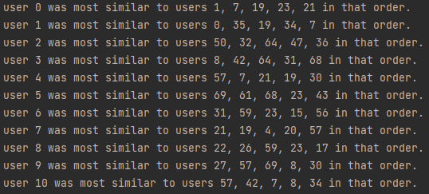

# Collaborative-Recommender

### Installation
1. Install Python 3.x
3. Install any other libraries required
4. Run ```if __name__ == '__main__':``` in ```main.py```

### Similarity in Movies


### Similarity in Users (User 0 is user I created)


### Reflection
As I compared mavies and users, I realized that comparing users was more efficient and helpful. Because there was less users, each time we compared users there was more items to compare(movies) but we had to compare them less times. Comparing users took much less time than movies. Also, comparing movies doesn't make much sense unless we have a ton of data.


### Resources
* [scipy](https://scipy.org/)
* [numpy](https://numpy.org/)
