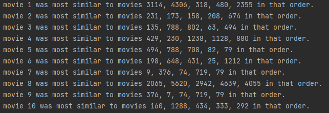

# Collaborative-Recommender

### Installation
1. Install Python 3.x
3. Install any other libraries required
4. Run ```if __name__ == '__main__':``` in ```main.py```

### Similarity in Movies


### Similarity in Users (User 0 is user I created)


### Reflection
As I compared movies and users, I realized that comparing users was more efficient and helpful. Because there was less users, each time we compared users there was more items to compare(movies) but we had to compare them less times. Comparing users took much less time than movies. Also, comparing movies doesn't make much sense unless we have a ton of data. If I had more time to work on this project, I would have a found a more efficient way to run algorithms on a sparse matrix so I could run more data. As of now, it took about 40 seconds to run the algorithm on 10 movies but i believe that could be cut down significantly. On the other hand, running the algorithm on 10 users took about 3 seconds. I ran this algorithm on 10,000 movies and use the scipy library to find the spatial distance cosine between 2 movies or users.

When I created my own user, I decided to give it the same first 8 movies that user one has. This let me test whether my algorith was accurately calculating the similarity between users. As you can see from the image above, the algorithm seems to work as user zero was most similar to user one. I also tested adding multiple new users and the prediction seemed to work as expected.

To make the algorithm better the predictor could account for other metrics such as length of time watched. Knowing the length of time watched could be an indicator of whether someone enjoyed the movie they were watching even if they didn't rate it. If someone watches a movie all the way through, it shows they probably didn't get bored during it. Also, the algorithm should randomly add movies to the reccomended to make sure movies aren't cut off from they system. If a movie is new or barely rated, it might not show up in the reccomendation even if it has potential to be a good movie.


### Resources
* [scipy](https://scipy.org/)
* [numpy](https://numpy.org/)
